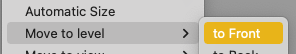
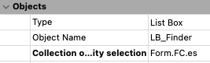
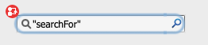
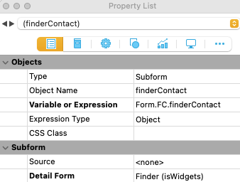
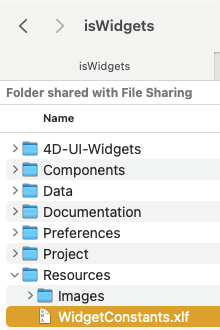
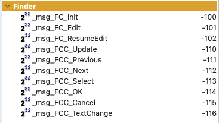

<!-- Finder -->

# Finder (Widget)

This `Form`  is designed as a widget that provides instant-reaction Search Bar Capability.

> #### 📌 This Form requires the Finder Classes:
>
> • cs.FinderGroup  • cs.Finder  • cs.FinderColumn

## 

## SUMMARY

The Finder widget can be used to

​	locate a specific record (or designate a 'new' record if no match, ready for input in an editor)

​	find a group of records that match its criteria. For example, it could be to provide GUI for a custom search editor.

It supports multiple levels of 'relevance' through individual query / coloring specifications.

In addition to the Finder Widget, the form requires the **LB_Finder** listbox and its corresponding **LB_FinderBox** opaque box. Note that, to avoid inadvertent hiding of the suggestions behind other screen elements, the **LB_FinderBox** should be in level 2 and **LB_Finder** the top object.

You will know you are missing the **LB_Finder** objects if the listbox does not appear while using the widget.

The **LB_Finder** listbox is already configured to work with the widget:

## SETTING UP THE WIDGET ON YOUR FORM

Place the widget on the Form and give it a **Name** (like all other form objects). This Name will be used in the scripts as **Form.FC[ObjectName]**.  Also ensure that the form  contains the **LB_Finder** objects mentioned above and that they are (preferably) the top two objects on the form so they do not 'hide' under other elements below the widget.

Properties:

The script for the Container Object (i.e. the Finder Subform) will typically be like:

**var** $event **:** **Object** // this is the 'Event' that the Finder object handled, in case we need to know

$event:=**Form**.FC[**OBJECT Get name**].*do*(**FORM Event**) // perform our functions!

**Case of** 

​	**:** ($event.code=_msg_FCC_Select) // if we have a selection made, we can process it. Otherwise we can just either wait or ignore it

​		**GOTO OBJECT**(*; "enContactFirst") // done

​	**:** ($event.code=_msg_FCC_Cancel) // told to cancel

​		**GOTO OBJECT**(*; "enContactFirst") // done

**End case** 

## CONFIGURATION

Configuration is performed in the *On Load* handler of the parent form.

1) the **FinderGroup** object is created. Only one is required per form:

​		// FORM METHOD

​		**:** (**Form event code**=On Load)	

​		**Form**.FC:=**cs.FinderGroup.*new*()

​		// Standard Naming of FinderGroup: It is best to set this name as 'Form.FC'. Then for subforms, make it so its 'Form.' object includes Form.FC from perspective of the subform. Then everything just works

2. Configure each **Finder**. 

   1.  define the COLUMNS of the listbox the Finder uses to show matches. Provide the Formula for the column and its width in pixels.

      1. EXAMPLE:

         $col1:=**cs.Finder.new\**(1; "This.First"; 100; Is text)		

         $col2:=**cs.Finder.new\**(2; "This.Last"; 100; Is text)

         $col3:=**cs.Finder.new\**(3; "This.ContactCompany.Name"; 200; Is text)

         — the listBox will display 400 pixels wide in total.

      

   2. specify the query command for each 'search level' using **Formula( )**

      1. $sf1:=**Formula**(**ds**.Contact.*query*("First = :1"; **Form**.FC.finderContact.searchFor+"@"))		

         $sf2:=**Formula**(**ds**.Contact.*query*("First = :1 or Last = :1"; "@"+**Form**.FC.finderContact.searchFor+"@"))

         $sf3:=**Formula**(**ds**.Contact.*query*("ContactCompany.Name = :1"; **Form**.FC.finderContact.searchFor+"@"))

         $sf4:=**Formula**(**ds**.Contact.*query*("ContactCompany.Name = :1"; "@"+**Form**.FC.finderContact.searchFor+"@"))

   3. 'bundle' these formulas into the 'QuerySpecs' object, along with the color you want for each relevance level:

      1. $col_QuerySpecs:=**New collection**(**New object**("formula"; $sf1; "color"; _RGB_Black); \		

         ​		**New object**("formula"; $sf2; "color"; _RGB_Blueberry); \

         ​		**New object**("formula"; $sf3; "color"; _RGB_Purple); \

         ​		**New object**("formula"; $sf3; "color"; _RGB_Red))

      The result of the sample setup is:

      | LEVEL | FORMULA                                                      | MATCH COLOR    |
      | ----- | ------------------------------------------------------------ | -------------- |
      | 1     | $sf1 (search for match from first character of Contact First Name) | _RGB_Black     |
      | 2     | $sf2 (search for a match from first char of First or Last Name) | _RGB_Blueberry |
      | 3     | $sf3 (Contact's Company Name from first character)           | _RGB_Purple    |
      | 4     | $sf3 (Match anywhere in Contact's Company Name)              | _RGB_Red       |

   4. Make the new Finder object:

      $finder:=***cs.Finder.new\***(**Form**.FC; "finderContact"; "Contact"; 5; "Search Contacts by Name or Company";\

       **New collection**($col1; $col2; $col3); "First ASC, Last ASC"; $col_QuerySpecs; **True**; **True**)

​	NOTE: Please check the **cs.Finder** instantiator to learn what each of the parameters is for.

At this point, the new Finder object is created, controlled by **Form.FC ** (the FinderGroup Object for the Form)

Do likewise for all other Finders you require on the form.

## PROGRAMMING THE WIDGET

The configuration tells the widget everything it needs in order to operate. All the widget's script needs to do is react to the events that it receives.

The script should basically be like the sample above under **UI**, which reacts only to _msg_FCC_Select and _msg_FCC_Cancel messages.

However, the widget can react to other events:

| EVENT               | MEANING                                                      |
| ------------------- | ------------------------------------------------------------ |
| _msg_FCC_Select     | User has selected a choice. Container should process the selection |
| _msg_FCC_Update     | selected record was 'updated' or the selection itself was updated. This will happen as characters are entered or the user navigates the 'suggestions' list with arrow keys. |
| _msg_FCC_TextChange | text in the 'Finder' was changed. While it is sent to the Container, it is actually processed in cs.FinderGroup.do() and does not require intervention. |
| _msg_FCC_Previous   | go to the previous record (listbox-caused). While it is sent to the Container, it is automatically processed. |
| _msg_FCC_Next       | go to the next record (listbox-caused). While it is sent to the Container, it is automatically processed. |
| _msg_FCC_Cancel     | restores the previous entity choice (automatically)          |

The entity selected will be **Form.FC[WidgetName].en**  (example: **Form.FC.finderContact.en**)

Immediately upon receiving **_msg_FCC_Select** a container script can also 'capture' the full entity selection of the matches. This will be in **Form.FC.es**. If you wish to use this selection (for example, to implement a search function) then copy this selection somewhere and use it.

As far as the widget is concerned, **Form.FC.es** is a 'temporary' selection and will be 'overwritten' the next time a Finder widget is entered. So it is important to copy this entity selection immediately if you need it.

For example:

$es:=Form.FC.es.copy()

Then your code can process this selection regardless of whether the cursor immediately enters another **Finder** widget.

## SPECIAL NOTE ON HANDLING 'NO MATCHES'

If there are no matches, then a NEW RECORD is created for the dataClass. It is "ready to go" for entering a new record.

This feature is helpful if you wish to provide a SEARCH ability on a master record's table to avoid duplication. Then if no match is found, the user can thereafter enter a NEW RECORD.

## TO PLACE THE FINDER SYSTEM INTO YOUR DATABASE

Copy into your Database:

1.  Classes:  **cs.FinderGroup**, **cs.Finder**, and **cs.FinderColumn**
2. Project Method: **FC_Widget_Do** (as it is required to work the mechanism unfortunately)
3.  Project Form **Finder**

And the 4D Pop 'constants' file (at least the constants used by the finder widget).

You may use the file supplied with **isWidgets**:

Or just create corresponding constants to the events used:

Note: the actual numeric values of the constants really doesn't matter, but...we all like it simple!

The **WidgetsConstants.xlf** file contains other constants I like, such as the RBG numbers and so on. You can root through that constants definition file and choose what would be useful to you.

## **OTHER PRACTICAL USE: FINDING A SELECTION OF RECORDS RATHER THAN A SPECIFIC ONE**

If you TRACE the execution on the demos, you can examine the object structure, which is all within **FORM.FC**. 

**FORM.FC** is the **FinderGroup** object. It contains **Finder**s, which in turn contain **FinderColumn**s.

When a finder is active, the **Form.FC.es** contains the entity selection of all the records that match the criteria. So instead of using the Finder Widget to find a *specific* record, you could use it to find a group of *matching* records, and perhaps use this as part of an interactive **FIND** window.

Other attributes may also be potentially very helpful to your purposes. 

For any other matters, please consult the demo; I think it is simple enough to illustrate the use of the widget.
