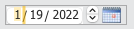
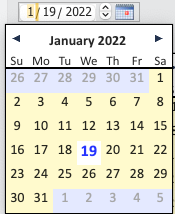

<!-- Type your summary here -->
## IS_DateEntry (Widget)

This `Form`  is designed as a widget that provides instant-reaction Date Entry Capability.

> #### 📌 This Form is part of a component. It is suggested to keep it in a component.
>
> There is one caveat; if the script of the widget *does not have the initialization code (i.e. on Load)* 4D will quit with a catastrophic error. So before operating a form on which you have placed these widgets, ensure that the widgets' scripts have the initialization code, which is simply like:
>
> ​	**:** (**Form event code**=On Load)
>
> ​		***IS_DATEENTRY_INIT\***($attributeName; $nextFormObjectName) 

## SUMMARY

The IS_DateEntry widget provides a convenient interface by which a user can enter dates strictly by keyboarding and with the assistance of a popup calendar. It operates on an object attribute or can accept a project variable as its dataSource.

## SETTING UP THE WIDGET ON YOUR FORM

For an example of using this widget in a form, consult the sample form **Date_Object_Widget_Test** in **isDateWidgetApp** (or in **isWidgets**).

Place the widget on the Form and give it a **Name** (like all other form objects). Set its datasource. If you are using it on an object attribute / entity attribute, set the datasource similar to the sample above.

The date widgets can also work with a process variable, but ensure that the variable is defined (C_DATE( ) or var xxx:Date) *or 4D will possibly throw pointer error messages.* In **Date_Object_Widget_Test**, a compiler directive is used to define the process variable in its object script.

## DATE ENTRY WIDGET OBJECT SCRIPT

If you have copy/pasted the widget from one that was already set up, the script is almost correct. The only thing you will need to do is specify the attribute (if the datasource is an object) in the On Load call.

**Case of** 

​	**:** (**Form event code**=On Load)

​		***IS_DATEENTRY_INIT\***("**formDate**"; "**entryDate**") // operate on .formDate; NEXT OBJECT name is entryDate

​	**:** (**Form event code**=_msgUpdate)

​	// react to the date change as appropriate. Note that the attribute will have the correct date.

**End case** 

## WHEN THE ENTITY CHANGES...

**OBJECT DATA SOURCE**

Unfortunately, *On Bound Variable Changed* does not trigger if the datasource is an object; it is understandable as we don't want changes to *other* attributes in an object to trigger all sorts of scripts in a mad chain-reaction,

What this means is that you must 'nudge' the date widget to update its display whenever the entity changes.

How to do this is demonstrated in the script of the **Simulate Different Entity** button script in the sample form **Date_Object_Widget_Test**.

All you need to do for each date widget is:

***IS_DATEENTRY_REFRESH\***($widgetName)

**PROCESS VARIABLE DATA SOURCE**

A change in a process variable will trigger *On Bound Variable Changed* and so it is not necessary to call **IS_DATEENTRY_REFRESH( )** when a process variable as the data source.

For any other matters, please consult the demo; I think it is simple enough to illustrate the use of the widget.
