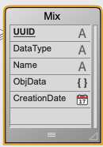
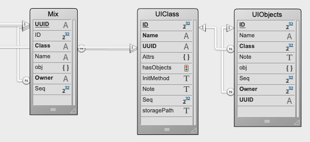

## isWidgets & isWidgetsDemoApp — README

This GitHub repository contains:

isWidgets  — a component that provides IS_DateEntry, IS_DatePicker & Finder widgets

isWidgetsDemoApp — a sample application that demonstrates how to configure these widgets in your own application

There is additional documentation for the **Finder** and **IS_DateEntry** widgets. You can view this documentation if you view those forms in **isWidgets** in 4D's *Explorer* and click on the *Documentation* button:

 

Alternatively, you will find these documentations in their respective location within **isWidgets**; namely:

\Forms\Finder\form.md  and \Forms\IS_DateEntry\form.md

Also consult the **Date Widget User Guide.pdf**, which is included in the same folder as this document (i.e. 'ReadMe')

## INSTALLATION

**isWidgets** is a component. I suggest you COMPILE and BUILD it using your current version of 4D and thereafter install the compiled version into the Components folder of your host database. 

isWidgetsDemoApp\Components contains a compiled version of isWidgets (19r3). If for some reason the demo doesn't work if you are using an earlier version of 4D, just do the Compile / Build suggested above and replace the widget.

Note that isWidgets exposes only the project methods that are needed to operate The Date widgets, provides instantiation methods to the **Finder** classes, and some other methods that may be helpful.

**NewFinder** — gives access to cs.Finder.new( )

**NewFinderGroup** — hook to cs.FinderGroup.new()

**NewFinderColumn** — hook to cs.FinderColumn.new()

While you are free to place these **Finder** - classes into your host database, it isn't necessary to. However you may find it enlightening to study these classes, trace and so on and see if there are any techniques that can help you in your own coding.

A fascinating aspect of the **Finder** classes is that they operate 'both sides of the equation' — they operate in the context of the Container Object (your form object) *and* in the context of the widget (a subform), messaging between the two contexts to accomplish their task. 

## isWidgets Contents

In addition to the widgets, there are project methods you may find beneficial in your own coding. Some of those methods are necessary to the functioning of the widgets, but others are including just to provide some 'goodies'.

## isWidgetsDemoApp

The FILE menu will open the demos for you. You can go into design mode to examine it further.

The other techniques demonstrated in the 4D Method demo are contained in this widget.

For example, the **DataStore** class contains the **ds.applyFormula( )** and **ds.newEntity( )** functions.

the **Contact** and **Company** classes include the **newEntity( )** function.

the **ContactEntity** and **CompanyEntity** classes demonstrate the use of **initConfig( )**, which is called by cs.Contact.newEntity( ) / cs.Company.newEntity( ) respectively.

and the **ContactSelection** and **CompanySelection** classes contain the **applyFormula( )** function, which calls **ds.applyFormula( )** in a one-liner.

The **Mix**, **MixEntity** and **MixSelection** demonstrate polymorphism. [Mix] is a table that can be adapted via the [Mix]ObjData object field to hold any type of data. You will notice that [Contact] actually relates to it in three relations, for Dept, City, and Role. So the demo is storing those records in [Mix]. You can explore this and see if this technique would be useful in your own databases.

The structure of **Mix** for the demo is simply:

For comparison, my own 'production' setup for Mix, UIClass & UIObjects is:

If you wish to adopt a similar structure, I would recommend implementing it without the **ID** field; I had both UUID & ID because an ID gives a simple way to generate a hierarchical list, which requires a **NUMERIC KEY: VALUE** pairing. But now that comboboxes and so on can use an object (with a collection) as a datasource, it is not necessary to set a 'choice list' for comboboxes and so on.

# Misc

If this code is useful to you, feel free to use it or change it as needed.

It is provided without warranty, and is not guaranteed to be flawless, though I am confident in its efficacy and am using this code myself in my own development, albeit as part of my own component Colonel.

Enjoy,

Chris Belanger,

Innovative Solutions (in Canada, not associated with Tim Nevel's USA company)

macprogrammer@gmail.com

